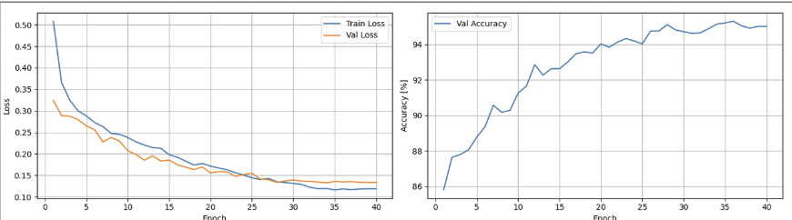
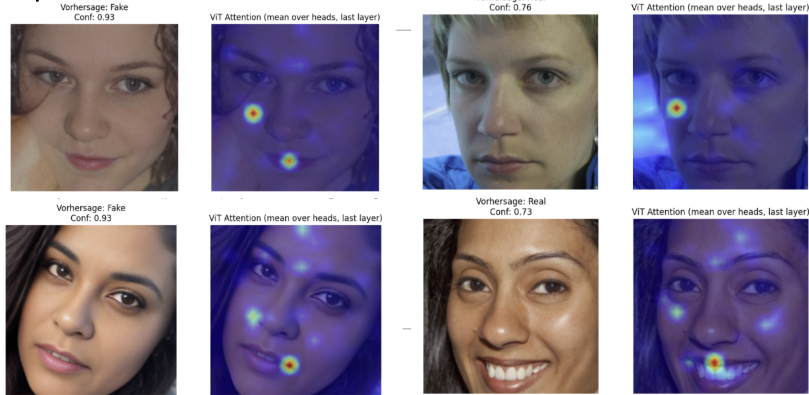
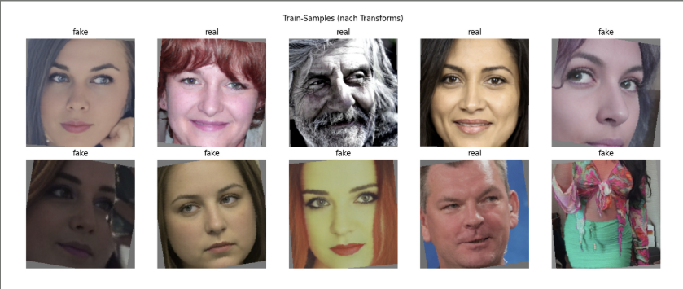

# Custom Vision Transformer (ViT) for Deepfake Detection 🛡️🔍

Dieses Repository enthält eine vollständige Deepfake-Erkennungspipeline. Im Zentrum steht ein **Vision Transformer (ViT)**, der von Grund auf in PyTorch entwickelt wurde. Das Modell lernt, KI-generierte Gesichtsmanipulationen anhand von feinen Textur- und Strukturmerkmalen zu identifizieren.

## 🧠 Architektur-Details
Im Gegensatz zur Verwendung von vortrainierten Modellen wurde diese Architektur spezifisch für dieses Projekt implementiert:

* **Patch Embedding:** Bilder (224x224) werden in 16x16 Patches zerlegt.
* **Transformer Encoder:**
    * 8 Layer Tiefe
    * 6 Attention Heads
    * 384 Embedding Dimension
* **Custom Class Token:** Ein lernbarer `cls_token` zur Klassifizierung.
* **Heads:** MLP-Head mit Layer Normalization zur finalen Entscheidung (Real vs. Fake).


## 🛠️ Besondere Features
* **Haar Cascade Face Detection:** Automatische Extraktion von Gesichtern mittels OpenCV.
* **Custom Data Augmentation:** Inklusive `RandomJPEGCompression`, um typische Artefakte zu simulieren.
* **Explainable AI (XAI):** Visualisierung der Attention-Maps, um die Entscheidungen des Modells nachvollziehbar zu machen.

## 📊 Ergebnisse & Visualisierung

### 1. Training & Validierung
Das Modell zeigt eine saubere Konvergenz. Die Accuracy auf den Validierungsdaten steigt stabil auf über 95%.


### 2. Attention-Maps (Erklärbarkeit)
Hier sieht man, worauf das Modell achtet. Die Heatmaps zeigen, dass der Transformer oft auf markante Gesichtszüge oder Artefakte im Bereich von Mund und Augen fokussiert, um Deepfakes zu entlarven.


### 3. Daten-Samples (nach Transformationen)
Beispiele für Bilder aus dem Datensatz, nachdem sie die Preprocessing-Pipeline (Gesichtsextraktion und Augmentation) durchlaufen haben:


## 🚀 Installation & Nutzung
1. Repository klonen:
   ```bash
   git clone https://github.com/Emon2402/Custom-Vision-Transformer-for-Deepfake-Detection.git
2. Abhängigkeiten installieren:
   ```bash
   pip install torch torchvision opencv-python matplotlib seaborn tqdm
3. Notebook starten:
   Öffne die Datei vit-deepfake-detection_final_version.ipynb in Jupyter oder Kaggle und führe alle Zellen aus.

## 📂 Datensätze
Das Modell wurde auf einer Kombination aus folgenden Kaggle-Datensätzen trainiert:
* Deepfake-vs-Real-60k (Sampled) https://www.kaggle.com/datasets/prithivsakthiur/deepfake-vs-real-60k
* Deepfake-vs-Real-20k (Sampled) https://www.kaggle.com/datasets/prithivsakthiur/deepfake-vs-real-20k
